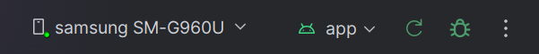

# OCTO
Open Camera Testbench and Orchestrator

## Welcome to OCTO! 🐙
OCTO is a computational imaging platform that grants a user more advanced access to all available cameras on an Android system. It exposes data that is typically obscured by stock camera apps, allows for RAW image capture, and allows for custom camera macros/scripts to be executed.

<div align="center">

<table>
  <tr>
    <td align="center">
      
      <br>
      <sub>Camera indexing and capability display</sub>
    </td>
    <td align="center">
      
      <br>
      <sub>Live camera preview and real-time metadata</sub>
    </td>
  </tr>
</table>

</div>

# NOTE

OCTO is currently a **research prototype**. The system has been built to provide a framework for computational imaging research, allowing for expansion of its features. This guide will cover how to add features should research require more advanced access to the camera.

## Current capabilities

* Indexing all system camera IDs and retrieving hardware characteristics (See Indexing)
* Opening any system camera, starting a live feed
* Displaying camera value updates in real time (See real-time metrics)
* RAW image capture capabilities
* Executing user-specified scripts from the open camera (See camera-scripting)

## Setup Guide

1. Clone this Git to your system
2. Download and install [Android Studio](https://developer.android.com/studio)
3. Open the project folder in Android Studio. The program files with all the OCTO code (MainActivity.kt, CameraPreview.kt, CameraMethods.kt, and WriteImagingScriptHere.kt) all live in app/src/main/java/com/example/hi_snr_computational_imaging
4. [Ensure that developer mode is enabled on your Android phone](https://developer.android.com/studio/debug/dev-options)
5. Connect your Android device over USB. Allow all connection prompts that the phone and your computer may give you.
7. Android Studio should automatically recognize your device over USB. It will appear in the top bar. If it fails to appear, try No Devices > Rescan. You may need to troubleshoot further if this doesn't fix it.
9. Press the green "Run 'app'" flag to build the program and send it to your phone via APK.
<div align="center">
  
</div>


## Quick start
1. Update WriteImagingScriptHere.kt with a custom camera script
2. Press the green flag to re-build to your device
3. Open the app, request camera permissions, and open a camera
4. Verify that live metadata is updating
5. Press "run script" to execute your custom imaging script


## App flow
[Watch a video demonstration of OCTO here](https://youtube.com/shorts/XyCGkq8VP7E)
1. Permissions:
The user is presented with a "Request Camera Permission" button. This checks whether or not the app has been granted system camera access. If it has, indexing begins immediately and all cameras and characteristics are displayed. If it hasn't the user is prompted to allow OCTO camera permissions. 

2. Indexing / Cameras
After ensuring permissions have been granted, OCTO enumerates all system cameras by hardware ID, displaying characteristics about each. Each camera is accompanied by a button allowing the user to open that camera. 

3. Live feed / Image Capture and Script Execution:
Opening any camera causes a live feed of camera frames to be sent to the app. Metadata is collected with every frame, being displayed over the feed. There are two buttons at the bottom, "Capture" and "Run Script". Capture requests and saves a RAW/DNG image. "Run Script" executes the custom camera script specified by the user. Both will be discussed in greater depth later. 


## File structure breakdown

OCTO currently has four core files, which all live within [`app/src/main/java/com/example/hi_snr_computational_imaging`](app/src/main/java/com/example/hi_snr_computational_imaging)

1. **MainActivity.kt**:

Handles the “Composable” functions, drawing screen UI, implementing buttons, etc. Any visual interface the app user might interact with is specified here. It also handles the camera indexing, querying the system for all available camera hardware IDs and displaying characteristics. (See Indexing)

2. **CameraPreview.kt**:

A framework heavy file that handles Kotlin setup to request live camera frames and display them to the app. RAW image-capture capabilities are instantiated here when the camera session is being configured. Also captures packets of metadata with every frame update, sending them to MainActivity.kt to display for live output. (See real-time metrics).

3. **CameraMethods.kt**:

General manipulation of the camera is performed here. Functions for things like manually specifying exposure, capturing a RAW image, and setting an ISO value can be performed here. Private helpers also exist to do things like disable or enable autofocus. This is effectively a library, providing all the useful camera functions that can be strung together to create imaging scripts. (Note: see Output for image capturing specifics. Also, see Focal sweep for more information on this method, as it is a bit more complex)

4. **WriteImagingScriptHere.kt**:

This is where the stringing along to specify an imaging script is performed. Functions from CameraMethods.kt can be strung together sequentially to create a custom macro. For example, specifying some values and capturing an image:

```
fun customImagingScript(camera2Controller: Camera2Controller) {


   //Example experiment configuration

   camera2Controller.setISO(500)

   camera2Controller.setExposureTime(10_000_000L) //10 ms exposure (Camera2 expects nanoseconds)

   camera2Controller.setFocusDistance(2.0f)       //2 diopters


   //Capture and save one RAW/DNG image

   camera2Controller.saveRaw("example_capture")

}
```

This script is directly linked to the "Execute Script" button created by MainActivity.kt that appears with live camera feed. Pressing the button calls customImagingScript().


## Processes:

**Indexing**:
MainActivity.kt exposes all local cameras by hardware IDs, and lists some of their characteristics. At the moment, the characteristics stored are:
- Camera ID: The internal ID used to identify each camera
- RAW: Indicates whether a RAW image can be shot with the camera 
- RAW sensor output resolution: RAW image dimensions supported by the selected camera
- Supports manual manipulation: Indicates whether or not the sensor allows for full programmatic control  
- Supports reading sensor settings: Indicates whether or not camera sensor settings can be read
- Bayer pattern: The CFA label for the 2x2 color pixel matrix (Ex: GRBG = [GR|BG])
- Auto-exposure compensation range: The min and max exposure compensation values that the camera's auto-exposure accepts.
- Auto-exposure compensation step: How much brightness change each one-step compensation value represents.
- Camera facing: the physical orientation of the camera on the phone (front or back)

**IMPORTANT!** Available characteristics are hardware-dependent, and not every characteristic is supported by every device. Many more characteristics are available through characteristics.get, found at the bottom of MainActivity.kt. Android has a [complete list of all camera characteristics in their API documentation.](https://developer.android.com/reference/kotlin/android/hardware/camera2/CameraCharacteristics)<br><br><br><br><br>


**Real-time Metrics**:
CameraPreview.kt records a set of metadata with every frame captured from the camera. Some of this data is displayed in real-time to provide at-a-glance confirmation that camera settings are in order, and contextualize what is being displayed. 

- ISO: The sensor sensitivity used to capture the current frame. This represents the amount of gain applied to the sensor data and is reported as a standard ISO sensitivity value.
- Exposure time: The amount of time each pixel is exposed to light for the current frame. Camera2 reports exposure time in nanoseconds.
- Sensor timestamp: The timestamp corresponding to the beginning of exposure for the first row of the sensor. This is reported in nanoseconds and can be used to associate a frame with other capture data from the same camera.
- Focus distance: The current focus position of the lens. On calibrated or approximately calibrated cameras, this is reported in diopters (1/m), where 0 represents focus at infinity and increasing values represent progressively closer focus. Uncalibrated cameras may not report this value in physically meaningful units.
- Auto-focus state: The current state of the camera's auto-focus (AF) algorithm, such as inactive, scanning, focused, or focus-locked.
- Auto-exposure state: The current state of the camera's auto-exposure (AE) algorithm, indicating whether it is inactive, searching for an exposure, converged, locked, or performing another exposure operation.
- Auto-white-balance (awb) state: The current state of the camera's auto-white-balance (AWB) algorithm, indicating whether white balance is inactive, searching, converged, or locked.
- Rolling shutter skew: The time between the beginning of exposure for the first row of the sensor and the beginning of exposure for the row immediately following the final sensor row. On a typical rolling-shutter camera, this approximately represents the frame readout time. Camera2 reports this value in nanoseconds.

[Android Camera State documentation](https://developer.android.com/reference/android/hardware/camera2/CameraMetadata)
Integer to state translation can be found here or in the "see also" section at the bottom. Note that UI-displayed values are for readability and may not perfectly reflect internal characteristic naming.

IMPORTANT! Like camera characteristics, the availability of some capture-result metadata is hardware-dependent and may not be available on every camera or Android device. Android has a [complete list of available CaptureResult values in their Camera2 API documentation](https://developer.android.com/reference/android/hardware/camera2/CaptureResult), and you can add more to CameraPreview.kt using 
```
result.get(CaptureResult.SOME_CHARACTERISTIC)
```
at the bottom of the file.<br><br><br><br><br>

**Focal Sweep**:
The focal sweep method lives in CameraMethods.kt and is callable from WriteImagingScriptHere.kt using
```
camera2Controller.startFocalSweep(
        1.0f,   //focus step in diopters. starts at 0 diopters and increases for after every capture request.
        300     //delay between focus change and capture, in ms
    )
```
The implementation of the method is somewhat involved. Because the focal sweep needs to repeatedly wait for the user's requested delay (allowing the camera to settle), the sweep runs inside a Kotlin coroutine. This allows delay() to suspend the sweep without blocking the app’s main thread.

The first method, startFocalSweep() is what is called from WriteImagingScriptHere.kt. It simply starts a Kotlin coroutine and requests the actual execution of the focal sweep.
```
    fun startFocalSweep(stepDiopters: Float, delayMS: Long) {
        //first, simply check if there is already a focalSweep active. reject the request if so. 
        if (focalSweepJob?.isActive == true) {
            Log.w("FOCUS_SWEEP", "Focal sweep already running.")
            return
        }

        //if no focal sweep is currently active, begin a Coroutine and request a focal sweep using the provided step and delay
        focalSweepJob = CoroutineScope(Dispatchers.Main).launch {
            focalSweep(stepDiopters, delayMS)
        }
    }
```


The second method, focalSweep(), is a ```suspend fun```, meaning it can pause at suspending operations such as delay() and later resume execution within the coroutine. It is too long to cleanly paste here, but a shortened/pseudo representation of the function would be: 
```
   suspend fun focalSweep(stepDiopters: Float, delayMS: Long){
        var currentFocusDiopters = 0.0f
        val sweepStartMs = SystemClock.elapsedRealtime()

        //validate that distances are ok for sweep
        if (maxFocusDiopters == null || maxFocusDiopters == 0.0f || stepDiopters <= 0.0f) {
            return
        }

        //perform sweep
        while(currentFocusDiopters < maxFocusDiopters){
            setFocusDistance(currentFocusDiopters)

            //specified delay - NOTE: THIS ALLOWS THE LENS TO SETTLE
            delay(delayMS)

            //save the output image using elapsed sweep time and focus distance in the filename
            val elapsedMs = SystemClock.elapsedRealtime() - sweepStartMs
            val focusLabel = "%.2f".format(currentFocusDiopters)
            saveRaw("${elapsedMs}ms_focus_${focusLabel}D")

            //log the RAW capture request
            Log.d("RAW_Requested", "RAW requested at ${currentFocusDiopters} diopters")
            currentFocusDiopters += stepDiopters
    }
}
```
 The RAW images captured by the method are found in the same folder as standard captures, detailed in the following Output section. Currently, output images are given a default name of the format of something like:
```1000ms_focus_1.00D.dng```
Meaning the image was taken at 1000 ms after execution of the sweep at a focus distance of 1 diopter.<br><br><br><br><br>

**Output**:
At the moment, OCTO only supports capturing RAW/DNG images using saveRaw(customName). All captured images live in the app's external files directory. On the dev device, the specific path is,
```
Internal-storage/Android/data/com.example.hi_snr_computational_imaging/files
```
and should be similar on other Android devices.
To create a DNG, OCTO requires two things for the internal dngCreator: the actual pixel data that will comprise the image, and the associated metadata for encoding. These things do not necessarily always arrive at the same time, meaning that there can be desync with the saving of images. Currently, OCTO simply tries to save when either arrives, and exits gracefully if the other isn't present. Additional RAW requests are ignored until the current image and capture metadata have been received and written.<br><br><br><br><br>


## Units and Displayed Values

| Screen | Value | Unit / Format | Notes |
|---|---|---|---|
| Indexing | Camera ID | ID string / number | Internal Android Camera2 identifier for the camera. |
| Indexing | RAW | Boolean (`true` / `false`) | Indicates whether the camera advertises support for RAW buffers and the metadata needed to interpret them. |
| Indexing | Manual sensor | Boolean (`true` / `false`) | Indicates whether the camera advertises the `MANUAL_SENSOR` capability, allowing direct control of sensor parameters. |
| Indexing | Read sensor settings | Boolean (`true` / `false`) | Indicates whether the camera advertises the ability to accurately report sensor settings while built-in camera algorithms are running. |
| Indexing | Bayer pattern | CFA pattern | Describes the color-filter arrangement in the sensor's top-left 2 × 2 region, such as `RGGB`, `GRBG`, `GBRG`, or `BGGR`. |
| Indexing | Exposure range | Exposure-compensation step counts | Minimum and maximum allowed auto-exposure compensation settings. Multiply these values by the Exposure step to determine the range in EV. Example: `[-20, 20]` with a `1/10 EV` step corresponds to `[-2 EV, +2 EV]`. |
| Indexing | Exposure step | Exposure Value (`EV`) per step | Amount of exposure compensation represented by one integer step. For example, `1/10` means each step changes the AE target by `0.1 EV`. |
| Indexing | Camera facing | Categorical (`Front`, `Back`, or `External`) | Direction the camera faces relative to the device screen. |
| Live camera | ISO | ISO sensitivity value | Standard ISO sensor-sensitivity value. |
| Live camera | Exposure | Nanoseconds (`ns`) | Length of time each pixel is exposed. `1 ms = 1,000,000 ns`. |
| Live camera | Timestamp | Nanoseconds (`ns`) | Timestamp corresponding to the beginning of exposure of the first sensor row. |
| Live camera | Focus distance | Diopters (`1/m`)* | `0` represents infinity and larger values represent closer focus when focus-distance calibration is `APPROXIMATE` or `CALIBRATED`. |
| Live camera | AF state | Integer state code | Current autofocus algorithm state. The number corresponds to an Android `CONTROL_AF_STATE_*` constant. |
| Live camera | AE state | Integer state code | Current auto-exposure algorithm state. The number corresponds to an Android `CONTROL_AE_STATE_*` constant. |
| Live camera | AWB state | Integer state code | Current auto-white-balance algorithm state. The number corresponds to an Android `CONTROL_AWB_STATE_*` constant. |
| Live camera | Rolling shutter | Nanoseconds (`ns`) | Time between the start of exposure of the first sensor row and the start of exposure immediately after the final row. |

*Physical diopter units for focus distance are only guaranteed when the camera reports `APPROXIMATE` or `CALIBRATED` focus-distance calibration.


**Known Limitations**
- OCTO is a framework on which to build. It doesn't contain advanced computational imaging processes by default.
- All RAW photos save to the app's directory by default, and there is currently no way to change that. 
- Live camera feed is currently hardcoded to 1920x1080.
- Only one RAW image can be requested at a time. Very short delays between requests can cause app instability or crashing. 
- RAW filenames are currently basic, and metadata isn't saved separately at the time of capture.
- Current focal sweep implementation requires a user specified time delay to space out when images are captured.
- Very short focal sweep delays can cause crashes, and the process is generally limited.
- Camera lifecycle handling and resource cleanup are basic and could be made more robust.
- Camera2Controller is a general camera object that currently handles several responsibilities at once, including camera control, RAW capture coordination, DNG writing, and scripting.
- OCTO has primarily been tested on the development Android phone and has not been extensively validated across different Android devices.
- OCTO will not stop the user from requesting an unsupported camera setting, characteristic, or value from the system.


